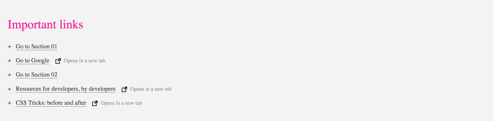

# Important links

- [] Add an icon after each external link: use the icon `out.svg` with the text: `Opens in a new tab`. External links lead to a page that is not part of your website. You can make use of type selectors.
- [] Display a `+` in front of each item and add space similat to the example image.
- [] Add custom underline for the anchor tags - the line should extend only under the text, not the entire element.
- [] Style the entire section with appropriate padding and background color.
- [] Style the headline

